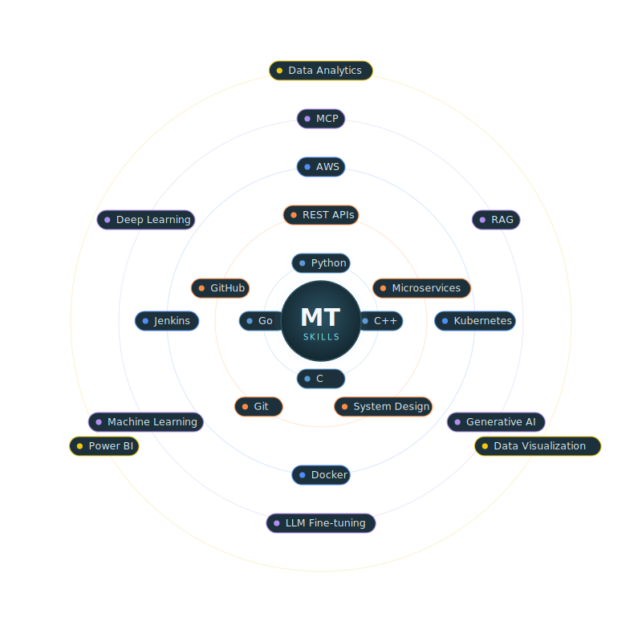

<!--
  GitHub Profile README for @manamnathtiwari
  Repo: github.com/manamnathtiwari/manamnathtiwari
  Tip: This file renders on your GitHub profile page.
-->

<div align="center">

<!-- ===== Header banner ===== -->


<!-- ===== Typing animation ===== -->
<a href="https://github.com/manamnathtiwari">
  
</a>

<!-- ===== Quick links ===== -->
<p>
  <a href="https://linkedin.com/in/manamnathtiwari"></a>
  <a href="mailto:manamnathtiwari@gmail.com"></a>
  <a href="https://github.com/manamnathtiwari"></a>
  
</p>

</div>

---

## 👋 About Me

```python
class ManamnathTiwari:
    def __init__(self):
        self.code        = ["Python", "C++", "Go"]
        self.focus       = ["Backend Engineering", "System Design", "DevOps"]
        self.currently   = "Designing software systems & building ML from scratch"
        self.motto       = "One who loves Logic, is seeing magic ✨"
        self.fun_fact    = "World is like chicken tandoori — and I'm vegetarian 😄"
```

- 🔭 Currently building **machine learning from scratch** and exploring **data science**.
- 🛡️ Created an **AI-powered Surveillance Camera** for real-time safety detection.
- 🏗️ Passionate about **backend engineering, software systems & system design**.
- ⚙️ Hands-on with **DevOps** — CI/CD, containers & cloud-native workflows.
- 🌐 Actively **contributing to open source** and learning by building in the open.

---

## ⚛️ Tech Orbit

<div align="center">



</div>

---

## 📈 GitHub Stats

<div align="center">


<br/>


<br/>


</div>

---

## 💬 Dev Quote

<div align="center">


</div>

---

## ♟️ My Signature Move

<div align="center">



</div>

---

<div align="center">

### 🐍 Watch my contributions get eaten


</div>
"# manamnathtiwari" 
